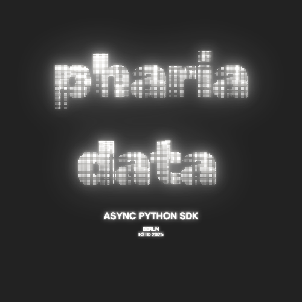

<div align="center">

# Pharia Data SDK



### Modern Python SDK for the Pharia Data API

*Type-safe • Async-first • Made for humans*

---

[](https://github.com/Aleph-Alpha/pharia_data_sdk/actions/workflows/ci.yml)
[](https://github.com/Aleph-Alpha/pharia_data_sdk/actions/workflows/codeql.yml)
[](https://www.python.org/downloads/)
[](https://docs.python.org/3/library/asyncio.html)
[](https://docs.python.org/3/library/typing.html)

**[📘 Quick Start](./QUICKSTART.md)** • **[📚 Examples](./examples/)** • **[🧪 Tests](./tests/)**

</div>

---

## ✨ Features

- 🚀 **Async/await** - Built on modern async Python
- 🎯 **Type-safe** - Full TypedDict support for autocomplete
- 🧩 **Intuitive API** - Clean, resource-based interface
- 📦 **Batteries included** - Stages, files, datasets, connectors, and more
- 🔧 **Flexible** - Easy configuration and customization

## ⚠️ Stability

This SDK follows the same stability guarantees as the [Go programming language](https://go.dev/doc/go1compat):

- **Before 1.0.0**: Breaking changes may occur between minor versions
- **After 1.0.0**: Code that works with 1.x will continue to work with all future 1.x releases
- Semantic versioning will be strictly followed after 1.0.0

## 📦 Installation

```bash
# Install directly from GitHub using uv (recommended)
uv pip install git+https://github.com/Aleph-Alpha/pharia_data_sdk.git

# Or add to your project dependencies
uv add git+https://github.com/Aleph-Alpha/pharia_data_sdk.git

# For development (clone and install)
git clone https://github.com/Aleph-Alpha/pharia_data_sdk.git
cd pharia_data_sdk
uv sync
```

## ⚙️ Configuration

The SDK requires two environment variables:

| Variable | Description |
|----------|-------------|
| `PHARIA_DATA_API_BASE_URL` | API base URL |
| `PHARIA_API_KEY` | API authentication key |


## 🚀 Quick Start

```python
import asyncio
from pharia import Client

async def main():
    # Client automatically reads from environment variables
    client = Client()

    # List all stages (v1 API)
    stages = await client.v1.stages.list(page=0, size=10)
    print(f"Found {stages['total']} stages")

    # Create a stage with embedding
    stage = await client.v1.stages.semantic.create(
        name="My Semantic Search Stage",
        embedding_model="luminous-base",
        representation="asymmetric"
    )

    # Create a search store (beta API)
    search_store = await client.beta.search_stores.semantic.create(
        name="My Search Store",
        embedding_model="luminous-base",
        representation="asymmetric",
        max_chunk_size_tokens=512,
        chunk_overlap_tokens=128
    )

asyncio.run(main())
```

## 🎯 API Resources

### V1 API (`client.v1.*`)

| Resource | Description |
|----------|-------------|
| `client.v1.stages` | Create and manage data stages |
| `client.v1.files` | Upload and manage files |
| `client.v1.datasets` | Dataset operations |
| `client.v1.repositories` | Repository management |
| `client.v1.connectors` | External data connectors |

### Beta API (`client.beta.*`)

| Resource | Description |
|----------|-------------|
| `client.beta.search_stores` | Create and manage search stores |

## 💡 Creating Stages with Embeddings

The SDK provides specialized methods for different embedding types:

```python
client = Client()  # Reads PHARIA_DATA_API_BASE_URL and PHARIA_API_KEY from env

# Simple stage (no embedding)
stage = await client.v1.stages.create(name="Simple Stage")

# Instruct embedding
stage = await client.v1.stages.instruct.create(
    name="Instruct Stage",
    embedding_model="pharia-1-embedding-256-control",
    instruction_document="Represent this document for retrieval",
    instruction_query="Represent this query for retrieval"
)

# Semantic embedding
stage = await client.v1.stages.semantic.create(
    name="Semantic Stage",
    embedding_model="luminous-base",
    representation="asymmetric"
)

# VLLM embedding
stage = await client.v1.stages.vllm.create(
    name="VLLM Stage",
    embedding_model="qwen3-embedding-8b"
)
```

## 🔍 Creating Search Stores (Beta)

Search stores provide standalone semantic search capabilities:

```python
client = Client()

# Semantic search store
search_store = await client.beta.search_stores.semantic.create(
    name="My Semantic Search Store",
    embedding_model="luminous-base",
    representation="asymmetric",
    max_chunk_size_tokens=512,
    chunk_overlap_tokens=128
)

# Instruct search store
search_store = await client.beta.search_stores.instruct.create(
    name="My Instruct Search Store",
    embedding_model="pharia-1-embedding-256-control",
    instruction_document="Represent this document for retrieval",
    instruction_query="Represent this query for retrieval",
    max_chunk_size_tokens=512,
    chunk_overlap_tokens=128
)
```

## 🛡️ Type Safety

Full TypedDict support for type checking and IDE autocomplete:

```python
from pharia import CreateRepositoryInput
from pharia import CreateStageInput
from pharia import DestinationType
from pharia import MediaType
from pharia import Modality
from pharia import TransformationName

# Type-safe inputs (all snake_case with enums)
stage_input: CreateStageInput = {
    "name": "My Stage",
    "triggers": [{
        "name": "my-trigger",
        "transformation_name": TransformationName.DOCUMENT_TO_TEXT,
        "destination_type": DestinationType.DATA_PLATFORM_REPOSITORY,
        "repository_id": "repo-id"
    }]
}

stage = await client.v1.stages.create(**stage_input)

# Type-safe repository creation with enums
repository = await client.v1.repositories.create(
    name="My Repository",
    media_type=MediaType.JSONLINES,
    modality=Modality.TEXT
)
```

All types and enums are defined in `pharia/models.py`.

## 📚 Examples

Check out the [examples directory](./examples/) for comprehensive guides:

- **[Basic Usage](./examples/basic_usage.py)** - Common operations and patterns
- **[Creating Stages](./examples/create_stages.py)** - All embedding types with working code
- **[Type-Safe Usage](./examples/typed_usage.py)** - Using TypedDict for type safety

Run any example:
```bash
cd examples
python create_stages.py
```

## 🧪 Testing

Run integration tests:
```bash
# Set your API credentials
export PHARIA_DATA_API_BASE_URL="https://<base-url>/api/v1"
export PHARIA_API_KEY="your-api-key"

# Run tests
pytest tests/
```

## 🔧 Advanced Configuration

```python
# Override environment variables
client = Client(
    base_url="https://custom-api.example.com",
    api_key="custom-key",
    timeout=30.0
)

# Clone client with new options
new_client = client.with_options(timeout=60.0)
```

## 📖 API Reference

See [models.py](./pharia/models.py) for all available types and their fields.

---

<div align="center">

**Built with ❤️ for the Pharia platform**

</div>
