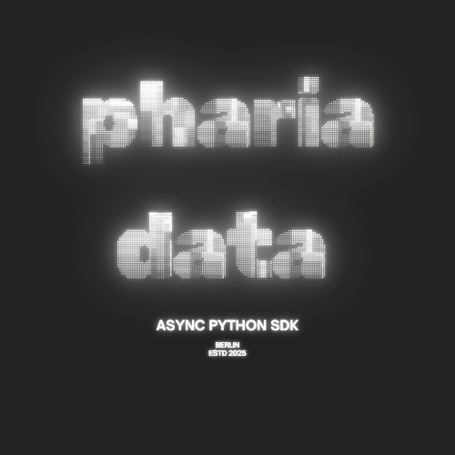

<div align="center">

# Pharia Data SDK



### Modern Python SDK for the Pharia Data API

*Type-safe - Async-first - Made for humans*

---

[](https://github.com/Aleph-Alpha/pharia_data_sdk/actions/workflows/ci.yml)
[](https://github.com/Aleph-Alpha/pharia_data_sdk/actions/workflows/codeql.yml)
[](https://www.python.org/downloads/)
[](https://docs.python.org/3/library/asyncio.html)
[](https://docs.python.org/3/library/typing.html)

**[Examples](./examples/)** | **[Tests](./tests/)**

</div>

---

## Features

- **Async/await** - Built on modern async Python
- **Type-safe** - Full TypedDict support for autocomplete
- **Fluent API** - Chain resources naturally: `client.v1.stages("id").files.list()`
- **Batch operations** - Concurrent get/delete: `client.v1.stages("a", "b", "c").delete()`
- **Batteries included** - Stages, files, repositories, datasets, connectors, search stores, and documents

## Stability

This SDK follows the same stability guarantees as the [Go programming language](https://go.dev/doc/go1compat):

- **Before 1.0.0**: Breaking changes may occur between minor versions
- **After 1.0.0**: Code that works with 1.x will continue to work with all future 1.x releases
- Semantic versioning will be strictly followed after 1.0.0

## Installation

```bash
uv pip install git+https://github.com/Aleph-Alpha/pharia_data_sdk.git

# Or add to your project dependencies
uv add git+https://github.com/Aleph-Alpha/pharia_data_sdk.git

# For development (clone and install)
git clone https://github.com/Aleph-Alpha/pharia_data_sdk.git
cd pharia_data_sdk
uv sync
```

## Configuration

The SDK requires two environment variables:

| Variable | Description |
|----------|-------------|
| `PHARIA_DATA_API_BASE_URL` | API base URL |
| `PHARIA_API_KEY` | API authentication key |


## Quick Start

```python
import asyncio
from pharia import Client

async def main():
    client = Client()  # reads from environment variables

    # List stages
    stages = await client.v1.stages.list(page=0, size=10)

    # Get a single stage
    stage = await client.v1.stages("stage-id").get()

    # Access nested resources
    files = await client.v1.stages("stage-id").files.list()
    runs  = await client.v1.stages("stage-id").runs.list()

    # Batch operations
    results = await client.v1.stages("id-1", "id-2", "id-3").get(concurrency=5)

    # Batch nested resources — fan out .list() across multiple parents
    all_files = await client.v1.stages("id-1", "id-2").files.list()
    all_runs  = await client.v1.stages("id-1", "id-2").runs.list()

asyncio.run(main())
```

## API Resources

All resources live under `client.v1`:

| Resource | Access | Description |
|----------|--------|-------------|
| Stages | `client.v1.stages` | Create and manage data stages |
| Files | `client.v1.stages("id").files` | Upload and manage files in a stage |
| Runs | `client.v1.stages("id").runs` | View stage processing runs |
| Repositories | `client.v1.repositories` | Repository management |
| Datasets | `client.v1.repositories("id").datasets` | Dataset operations within a repository |
| Connectors | `client.v1.connectors` | External data connectors |
| Search Stores | `client.v1.search_stores` | Semantic search stores |
| Documents | `client.v1.search_stores("id").documents` | Documents within a search store |

### Fluent API Pattern

Every resource supports single-item and batch access:

```python
# Single resource
stage = await client.v1.stages("stage-id").get()
await client.v1.stages("stage-id").update(access_policy="private")
await client.v1.stages("stage-id").delete()

# Batch resources
stages = await client.v1.stages("id-1", "id-2").get()
await client.v1.stages("id-1", "id-2").delete()

# Batch nested resources — fan out .list() concurrently
all_files = await client.v1.stages("id-1", "id-2").files.list()
all_runs  = await client.v1.stages("id-1", "id-2").runs.list()
all_docs  = await client.v1.search_stores("ss-1", "ss-2").documents.list()
all_ds    = await client.v1.repositories("r-1", "r-2").datasets.list()

# Nested resources
file_content = await client.v1.stages("stage-id").files("file-id").get()
presigned    = await client.v1.stages("stage-id").files("file-id").presigned_url(ttl=3600)
```

## Creating Stages with Embeddings

The SDK provides specialized helpers for each embedding strategy:

```python
client = Client()

# Simple stage (no embedding)
stage = await client.v1.stages.create(name="Simple Stage")

# Instruct embedding
stage = await client.v1.stages.instruct.create(
    name="Instruct Stage",
    embedding_model="pharia-1-embedding-4608-control",
    instruction_document="Represent this document for retrieval",
    instruction_query="Represent this query for retrieval",
    hybrid_index="bm25",
    max_chunk_size_tokens=512,
    chunk_overlap_tokens=128,
)

# Semantic embedding
stage = await client.v1.stages.semantic.create(
    name="Semantic Stage",
    embedding_model="luminous-base",
    representation="asymmetric",
    hybrid_index="bm25",
    max_chunk_size_tokens=1024,
    chunk_overlap_tokens=256,
)

# VLLM embedding
stage = await client.v1.stages.vllm.create(
    name="VLLM Stage",
    embedding_model="qwen3-embedding-8b",
    hybrid_index="bm25",
    max_chunk_size_tokens=2046,
    chunk_overlap_tokens=512,
)
```

## Search Stores and Documents

Search stores provide standalone semantic search. Documents live inside search stores.

```python
client = Client()

# Create a search store
ss = await client.v1.search_stores.semantic.create(
    name="My Search Store",
    embedding_model="luminous-base",
    representation="asymmetric",
    max_chunk_size_tokens=512,
    chunk_overlap_tokens=128,
)
ssid = ss["id"]

# Add a document (schema_version defaults to V1)
doc = await client.v1.search_stores(ssid).documents("my-doc").create_or_update(
    contents=[{"modality": "text", "text": "Hello world."}],
    metadata={"source": "example"},
)

# Get document metadata and content
meta    = await client.v1.search_stores(ssid).documents("my-doc").get()
content = await client.v1.search_stores(ssid).documents("my-doc").get_content()  # list[ContentDTO]

# Search
results = await client.v1.search_stores(ssid).search(query="hello", limit=5)

# List, filter, batch
docs = await client.v1.search_stores(ssid).documents.list(page=1, size=10, starts_with="my")
batch = await client.v1.search_stores(ssid).documents("doc-a", "doc-b").get()

# Cleanup
await client.v1.search_stores(ssid).documents("my-doc").delete()
await client.v1.search_stores(ssid).delete()
```

### Search Store Embedding Helpers

```python
# Instruct
ss = await client.v1.search_stores.instruct.create(
    name="Instruct Store",
    embedding_model="pharia-1-embedding-4608-control",
    instruction_document="Represent the document for retrieval",
    instruction_query="Represent the query for retrieval",
)

# VLLM
ss = await client.v1.search_stores.vllm.create(
    name="VLLM Store",
    embedding_model="qwen3-embedding-8b",
)
```

## Type Safety

Full TypedDict support for type checking and IDE autocomplete:

```python
from pharia import CreateStageInput, DestinationType, MediaType, Modality, TransformationName

# Type-safe inputs (all snake_case with enums)
stage_input: CreateStageInput = {
    "name": "My Stage",
    "triggers": [{
        "name": "my-trigger",
        "transformation_name": TransformationName.DOCUMENT_TO_TEXT,
        "destination_type": DestinationType.DATA_PLATFORM_REPOSITORY,
        "repository_id": "repo-id"
    }]
}

stage = await client.v1.stages.create(**stage_input)

# Type-safe repository creation with enums
repository = await client.v1.repositories.create(
    name="My Repository",
    media_type=MediaType.JSONLINES,
    modality=Modality.TEXT,
)
```

All types and enums are defined in `pharia/models.py`.

## Examples

Check out the [examples directory](./examples/) for comprehensive guides:

- **[Basic Usage](./examples/basic_usage.py)** - Common operations and patterns
- **[Creating Stages](./examples/create_stages.py)** - All embedding types with working code
- **[Search Stores](./examples/search_stores_usage.py)** - Search store lifecycle and search
- **[Type-Safe Usage](./examples/typed_usage.py)** - Using TypedDict for type safety

Run any example:
```bash
cd examples
python create_stages.py
```

## Testing

Run integration tests:
```bash
export PHARIA_DATA_API_BASE_URL="https://<base-url>"
export PHARIA_API_KEY="your-api-key"

uv run pytest tests/
```

## Advanced Configuration

```python
# Override environment variables
client = Client(
    base_url="https://custom-api.example.com",
    api_key="custom-key",
    timeout=30.0
)

# Clone client with new options
new_client = client.with_options(timeout=60.0)
```

## API Reference

See [models.py](./pharia/models.py) for all available types and their fields.
